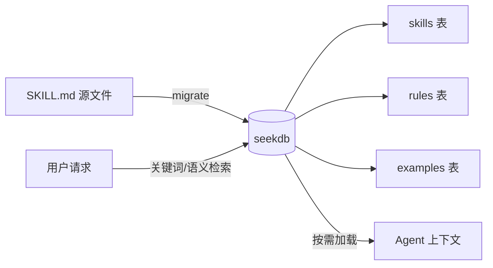
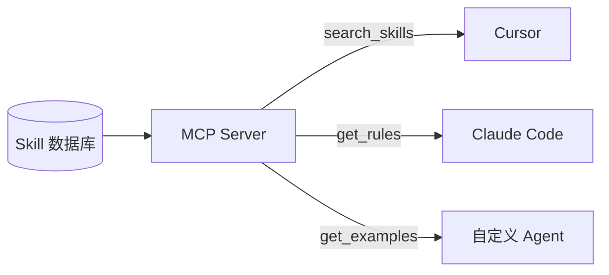

# X2：多 Skill 给上下文工程带来的麻烦 —— 如何应对 Agent「爆上下文」

## 摘要

| | |
| --- | --- |
| **解决什么痛点** | Skill 数量增长后全量注入上下文，导致 Token 成本高、注意力稀释、无关规则干扰 |
| **核心价值** | 结构化存储 + 按需检索，把 Skill 从「配置文件」升级为「可查询的数据资产」 |
| **适用场景** | 团队维护多个 Skill、跨工具复用、Agent 需要根据任务动态选择 Skill |
| **关联正文** | 道篇 P4（Skill 与知识管理） |
| **实战代码** | [`code/X2/`](https://github.com/datawhalechina/easy-data-x-ai/tree/main/code/X2) |
| **完整案例** | [oceanbase-doc-skills](https://github.com/amber-moe/oceanbase-doc-skills) |

> 在 P4 的基础上，本章给出一条可落地的路径：当 Skill 越来越多、全量注入导致「爆上下文」时，如何用结构化存储 + 按需检索来管理 Skill，并附一套可复用的 Skill 设计规范。

**目录**

- [1. 问题：Skill 全量注入的「爆上下文」](#1-问题skill-全量注入的爆上下文)
- [2. 思路：把 Skill 当作数据资产来管理](#2-思路把-skill-当作数据资产来管理)
- [3. 方案：结构化存储 + 按需加载](#3-方案结构化存储--按需加载)
- [3.4 配套代码说明](#34-配套代码说明)
- [4. 实战：从 SKILL.md 到数据库](#4-实战从-skillmd-到数据库)
- [5. 对比：全量注入 vs 按需加载](#5-对比全量注入-vs-按需加载)
- [6. Skill 设计规范](#6-skill-设计规范)
- [7. 生产案例：oceanbase-doc-skills](#7-生产案例oceanbase-doc-skills)
- [8. 从 Skill 到 MCP](#8-从-skill-到-mcp)
- [9. 总结与下一步](#9-总结与下一步)

---

## 1. 问题：Skill 全量注入的「爆上下文」

P4 讲过：当 Agent 有几十个甚至上百个可用 Skill 时，最朴素的做法是**全部加载**——把所有 Skill 文档一股脑塞进上下文窗口。

Skill 少的时候这没问题。三五条规则、每条几百字，Agent 读一遍就知道该遵循什么。

但当 Skill 数量增长到几十个、内容总量达到几万字甚至更多时，三个问题同时出现：

### 1.1 上下文窗口被挤占

F1 里讲过：大模型的上下文窗口就是一张工作台，空间有限。把几十份 Skill 文档全摊在工作台上，留给用户实际问题和对话历史的空间就不够了。

以一个真实场景为例：[oceanbase-doc-skills](https://github.com/amber-moe/oceanbase-doc-skills) 仓库维护了 6 个 OceanBase 文档写作 Skill，每个 SKILL.md 约 1500–3000 字。6 个全量注入 ≈ **12,000–18,000 字 ≈ 4,000–6,000 Token**，还没开始处理用户请求，上下文已经占去一大块。

### 1.2 注意力被稀释

即使上下文窗口够大，研究也表明：输入文本过长时，模型对「中间部分」的信息关注度会下降。你最需要的那条 Skill 如果恰好被淹没在一大堆不相关的规则中间，Agent 很可能会忽略它。

### 1.3 不相关 Skill 造成干扰

用户在问前端组件问题时，上下文里却塞着一堆数据库文档写作规则——这些不相关的 Skill 不仅占空间，还可能让 Agent 的回答偏离方向。

**本质上，这和 P2 讲的 RAG 是同一个问题**：不是「有没有 Skill」，而是「能不能找到对的 Skill」。

---

## 2. 思路：把 Skill 当作数据资产来管理

P4 的核心判断在这里完全适用：

> Skill 分散在不同的文件系统、不同的项目目录、不同的平台配置中——无法被统一检索、无法被团队共享、无法被跨 Agent 复用。**这不是工程问题，这是数据管理问题。**

解题方向：

1. **Skill 需要被结构化存储** — 拆分为元数据、规则、示例等可独立检索的单元
2. **Skill 需要按需检索** — Agent 根据当前任务语义，动态匹配最佳 Skill
3. **Skill 需要跨工具共享** — 统一的检索层，让 Cursor、Claude Code 等不同 Agent 都能访问

这和 P2 给 Agent 建知识库、P3 给 Agent 建记忆系统，是完全一致的思路：

| 数据类型 | 管理对象 | 检索方式 |
| --- | --- | --- |
| 知识库 | 事实文档 | RAG 语义检索 |
| 记忆系统 | 用户数据 | 按 user_id + 时间检索 |
| **Skill 库** | **经验规则** | **按任务语义 + 关键词检索** |

---

## 3. 方案：结构化存储 + 按需加载

[oceanbase-doc-skills](https://github.com/amber-moe/oceanbase-doc-skills) 项目给出了一套经过生产验证的方案。核心架构如下：



### 3.1 三层数据模型

| 表 | 存储内容 | 按需加载时的作用 |
| --- | --- | --- |
| **skills** | 名称、描述、完整 Markdown 正文、分类、版本 | 检索匹配 → 加载元数据和描述 |
| **rules** | 从正文中抽取的格式化/命名/语法规则 | 只加载 Top-N 高优先级规则 |
| **examples** | 从正文中抽取的代码示例和结果 | 按需加载相关示例 |

关系：`skills (1) ──< (N) rules`，`skills (1) ──< (N) examples`

### 3.2 双模式使用

方案支持两种使用模式，可以平滑过渡：

| 模式 | 适用场景 | 用法 |
| --- | --- | --- |
| **直接引用** | Skill 少、个人使用 | 在 Cursor 中 `@skills/xxx/SKILL.md` |
| **数据库检索** | Skill 多、团队共享 | 通过 QueryService 按需加载 |

开发阶段用 SKILL.md 直接编辑，生产阶段迁移到数据库按需检索——**源文件始终是 Markdown，数据库是索引层**。

### 3.3 seekdb 存储与混合检索

[`code/X2/`](https://github.com/datawhalechina/easy-data-x-ai/tree/main/code/X2) 使用 [seekdb](https://docs.seekdb.ai/seekdb/doc-overview/) 作为 Skill 存储层（需 **Python 3.11+**），三个集合对应 skills / rules / examples：

- **向量语义检索** — 「帮我写 API 文档」能匹配到 `api-doc-writing`，即使用户没说关键词
- **混合检索** — `collection.query()` 同时支持向量 + 全文（`where_document`），参见 seekdb 官方文档
- **统一数据层** — 与课程 D2/D3 相同的 pyseekdb API，可与知识库、记忆共存于同一 seekdb 实例

#### macOS / Windows：Docker 启动 seekdb Server（课程推荐）

嵌入式 seekdb 依赖 `pylibseekdb`，**仅 Linux 可用**。macOS 学员请用 Docker：

```bash
cd code/X2
docker compose up -d
python database/check_seekdb.py   # 应输出 ✓ seekdb 可用
```

`docker-compose.yml` 会映射 `2881` 端口并自动创建 `x2_skills` 数据库。连接参数可通过 `.env.example` 复制为 `.env` 后修改。

Linux 用户可跳过 Docker，直接使用嵌入式模式（数据目录 `database/skills.seekdb/`）。

### 3.4 配套代码说明

[`code/X2/`](https://github.com/datawhalechina/easy-data-x-ai/tree/main/code/X2) 是本节的完整可运行示例，在 [oceanbase-doc-skills](https://github.com/amber-moe/oceanbase-doc-skills) 架构基础上将 SQLite 换成了 seekdb，并补齐了课程所需的 Docker 启动与连接检测。整体数据流是：**SKILL.md 源文件 → 解析抽取 → seekdb 三集合 → 混合检索 → 按需注入 Agent 上下文**。

| 目录 / 文件 | 作用 |
| --- | --- |
| `skills/` | 示例 Skill 源文件（如 `api-doc-writing/SKILL.md`），开发阶段在此编辑 |
| `parsers/` | 解析 SKILL.md 的 frontmatter，并从 `## Formatting rules` 等章节抽取 rules / examples |
| `models/` | `Skill`、`Rule`、`Example` 数据模型，rules 与 examples 通过 `skill_name` 关联 |
| `storage/` | `SkillStorage` 抽象接口与 `SeekdbStorage` 实现，负责写入与查询三个 seekdb 集合 |
| `database/` | seekdb 连接封装（`seekdb_client.py`）、集合初始化（`init_seekdb.py`）、连接检测（`check_seekdb.py`） |
| `services/` | 业务层：`MigrationService` 迁移、`QueryService` 检索、`SkillService` 管理 |
| `tools/` | 命令行工具：`migrate.py` 批量入库、`query_tool.py` 交互查询 |
| `x2_1_compare_context.py` | 对比 demo：全量注入 vs 按需加载的 Token 开销 |
| `docker-compose.yml` | macOS / Windows 一键启动 seekdb Server（课程推荐） |
| `.env.example` | seekdb 连接参数模板，复制为 `.env` 后可覆盖默认配置 |

三个 seekdb 集合与 §3.1 三层模型一一对应：

| 集合 | 对应概念 | 典型操作 |
| --- | --- | --- |
| `x2_skills` | skills 表 | `search_skills(query)` 混合检索匹配 Skill |
| `x2_rules` | rules 表 | `get_rules_by_skill(name)` 按 Skill 加载高优先级规则 |
| `x2_examples` | examples 表 | `get_examples_by_skill(name)` 按需加载代码示例 |

本地开发时请在 `code/X2` 下自行创建虚拟环境并 `pip install pyseekdb PyYAML`（`.venv` 目录已通过 `.gitignore` 排除，不会进入版本库）。更完整的命令说明见 [`code/X2/README.md`](https://github.com/datawhalechina/easy-data-x-ai/tree/main/code/X2/README.md)。

---

## 4. 实战：从 SKILL.md 到数据库

课程配套代码位于 [`code/X2/`](https://github.com/datawhalechina/easy-data-x-ai/tree/main/code/X2)，在 oceanbase-doc-skills 架构基础上用 seekdb 替换了 SQLite。§3.4 已介绍各模块职责，下面从动手跑通开始。

### 4.1 初始化与迁移

```bash
cd code/X2

# 0. 启动 seekdb（macOS / Windows 必做；Linux 可跳过）
docker compose up -d
python database/check_seekdb.py

# 1. 安装依赖（Python 3.11+）
pip install pyseekdb PyYAML

# 2. 初始化 seekdb 集合
python database/init_seekdb.py

# 3. 将所有 SKILL.md 迁移入库
python tools/migrate.py skills/ --all
```

迁移过程自动完成三件事：

1. **解析 frontmatter** — 提取 name、description、license、metadata
2. **抽取 rules** — 从 `## Formatting rules`、`## Best practices` 等章节提取列表项
3. **抽取 examples** — 从 Markdown 代码块提取示例代码和结果

### 4.2 按需查询

```bash
# 列出所有 Skill
python tools/query_tool.py list

# 关键词搜索
python tools/query_tool.py search "api"

# 获取完整 Skill（含 rules 和 examples）
python tools/query_tool.py get api-doc-writing

# 只获取规则
python tools/query_tool.py rules api-doc-writing
```

### 4.3 Python API

在 Agent 代码中按需加载 Skill：

```python
from services import QueryService

service = QueryService("database/skills.seekdb")

# 混合检索相关 Skill
skills = service.search_skills("api documentation")

# 只加载匹配 Skill 的高优先级规则（而非全部 Skill 正文）
for skill in skills:
    rules = service.get_rules_by_skill(skill.name)
    top_rules = sorted(rules, key=lambda r: r.priority, reverse=True)[:5]
    for rule in top_rules:
        print(f"- {rule.rule_value}")
```

### 4.4 Agent 集成模式

一个典型的按需加载流程：

```
用户请求 → 提取关键词/语义向量
         → 检索 Skill 库（search_skills / 向量检索）
         → 加载 Top-K 匹配 Skill 的 rules + examples
         → 注入 Agent 上下文
         → Agent 执行任务
```

关键原则：**永远不要把全部 Skill 注入上下文，只注入与当前任务相关的子集。**

---

## 5. 对比：全量注入 vs 按需加载

运行配套示例脚本：

```bash
python x2_1_compare_context.py
```

以「帮我写一份 REST API 接口文档」为例：

| 指标 | 全量注入 | 按需加载 |
| --- | --- | --- |
| 加载 Skill 数 | 全部（N 个） | 1–2 个匹配项 |
| 上下文字符数 | 全部 Skill 正文之和 | 匹配 Skill 的 Top-5 规则 |
| 估算 Token | ~4,000–6,000（6 个 Skill） | ~200–500 |
| 节省比例 | — | **~85–95%** |

按需加载不仅省 Token，更重要的是**信号更干净**——Agent 只看到与当前任务相关的规则，不会被无关 Skill 干扰。

> 注意：上面的 Token 估算是粗略值（字符数 ÷ 3）。实际 Token 数取决于模型分词器，但节省比例的趋势是稳定的。

---

## 6. Skill 设计规范

要让结构化存储和按需检索真正生效，Skill 本身需要遵循统一格式。以下规范提炼自 oceanbase-doc-skills 的生产实践，对应共建任务 [#22](https://github.com/datawhalechina/easy-data-x-ai/issues/22) / [#23](https://github.com/datawhalechina/easy-data-x-ai/issues/23)。

### 6.1 文件结构

```
skills/
└── {skill-name}/
    └── SKILL.md
```

### 6.2 Frontmatter 标准

每个 SKILL.md 必须以 YAML frontmatter 开头：

```yaml
---
name: api-doc-writing          # 唯一标识，kebab-case
description: >                 # 一句话描述，含使用场景
  Write clear API documentation.
  Use when creating or editing REST API reference docs.
license: MIT
metadata:
  audience: developers         # 目标受众
  domain: technical-writing    # 领域标签（用于分类检索）
---
```

| 字段 | 必填 | 说明 |
| --- | --- | --- |
| `name` | 是 | 全局唯一，kebab-case，用于检索和引用 |
| `description` | 是 | 包含 WHAT（做什么）和 WHEN（什么时候用），这是 Agent 选择 Skill 的主要依据 |
| `license` | 否 | 开源协议 |
| `metadata.audience` | 推荐 | 目标用户群体 |
| `metadata.domain` | 推荐 | 领域标签，用于分类过滤 |

### 6.3 正文结构

```markdown
# Skill Title

## When to use          ← Agent 判断是否需要此 Skill

## Document structure   ← 领域知识

## Formatting rules     ← 自动抽取为 rules 表
- Rule 1
- Rule 2

## Best practices       ← 自动抽取为 rules 表
- Practice 1

## Example              ← 自动抽取为 examples 表
​```bash
curl ...
​```
```

**关键约定：**

- 规则用 `## Formatting rules` / `## Best practices` 等标准章节标题，便于自动抽取
- 每条规则用 `- ` 列表项，一句话说清
- 示例用 fenced code block，语言标签标注类型（`sql`、`bash`、`json` 等）

### 6.4 命名规范

| 类型 | 规范 | 示例 |
| --- | --- | --- |
| Skill 名称 | `{domain}-{capability}`，kebab-case | `api-doc-writing`, `oceanbase-sql-doc` |
| 规则 key | 自动生成，snake_case | `use_lowercase_for_url_paths` |
| 分类 | 从 name 推断或 metadata 指定 | `doc-writing`, `sql-doc` |

---

## 7. 生产案例：oceanbase-doc-skills

[oceanbase-doc-skills](https://github.com/amber-moe/oceanbase-doc-skills) 是上述方案的完整生产实现，管理 OceanBase 数据库文档写作的 6 个 Skill：

| Skill | 用途 |
| --- | --- |
| `oceanbase-sql-doc` | SQL 语句文档写作规范 |
| `oceanbase-formatting` | Markdown 格式化与 lint 合规 |
| `oceanbase-examples` | SQL 示例创建指南 |
| `oceanbase-syntax` | SQL 语法定义规范 |
| `oceanbase-sql-optimization` | SQL 优化最佳实践 |
| `oceanbase-schema-design` | Schema 设计（表、分区、索引） |

### 7.1 使用方式

**直接引用（开发阶段）：**

```text
Please follow the rules in skills/oceanbase-sql-doc/SKILL.md when writing documentation
```

**数据库检索（生产阶段）：**

```bash
python database/init_db.py
python tools/migrate.py skills/ --all
python tools/query_tool.py search "sql syntax"
```

**通过 skills.sh 安装：**

```bash
npx skills add amber-moe/oceanbase-doc-skills
```

### 7.2 迁移与更新

Skill 内容变更后，重新迁移即可同步到数据库：

```bash
python tools/migrate.py skills/ --all --force
```

`--force` 会更新已有 Skill 并重新抽取 rules 和 examples。

---

## 8. 从 Skill 到 MCP

当 Skill 被结构化管理后，下一步是自然的问题：**如何让不同的 Agent 工具都能调用这些 Skill？**

### 8.1 当前困境

| 工具 | Skill 形态 | 加载方式 |
| --- | --- | --- |
| Cursor | `.cursor/rules/` 或 Agent Skills | 项目级配置 |
| Claude Code | `CLAUDE.md` + Skills | 项目根目录 |
| 自定义 Agent | Python API | 自行集成 |

每种工具的 Skill 格式和加载机制不同，导致 P4 讨论的「碎片化」问题。

### 8.2 MCP 作为标准化桥梁

[MCP（Model Context Protocol）](https://modelcontextprotocol.io/) 提供了一种标准化的方式，把 Skill 发布为 Agent 可调用的 Tool：

```
Skill 数据库 → MCP Server → Cursor / Claude / 任意 Agent
```

设想中的架构：



MCP Server 暴露的 Tool 示例：

| Tool | 功能 |
| --- | --- |
| `search_skills(query)` | 按关键词/语义搜索 Skill |
| `get_skill_rules(name)` | 获取指定 Skill 的规则 |
| `get_skill_examples(name)` | 获取指定 Skill 的示例 |

这样，**Skill 的存储和检索逻辑只写一次**，任何支持 MCP 的 Agent 都能按需调用——这正是 D5 共建任务 [#34](https://github.com/datawhalechina/easy-data-x-ai/issues/34) 的方向。

---

## 9. 总结与下一步

### 核心要点

1. **Skill 全量注入不可持续** — Skill 数量增长后，Token 成本、注意力稀释、无关干扰三重问题同时出现
2. **Skill 是数据资产** — 需要结构化存储（skills / rules / examples）和按需检索，而非散落在文件系统里的配置文件
3. **双模式平滑过渡** — 开发阶段直接编辑 SKILL.md，生产阶段迁移到数据库按需加载
4. **统一格式是关键** — frontmatter + 标准章节结构，让自动抽取和检索成为可能
5. **MCP 是下一步** — 标准化协议让 Skill 跨 Agent 工具复用

### 行动清单

- [ ] 盘点你团队当前的 Skill 数量和总 Token 开销
- [ ] 按照 [§6 Skill 设计规范](#6-skill-设计规范) 整理现有 Skill 格式
- [ ] 运行 [`code/X2/`](https://github.com/datawhalechina/easy-data-x-ai/tree/main/code/X2) 示例，体验迁移和按需加载
- [ ] 参考 [oceanbase-doc-skills](https://github.com/amber-moe/oceanbase-doc-skills) 搭建团队 Skill 库
- [ ] 进阶：与 D2 知识库共用 seekdb 实例，启用统一混合检索（参见 X3）

### 关联资源

- **P4 正文**：[Skill 与 Agent 知识管理](/pm/P4%20课程稿：Skill%20与%20Agent%20知识管理)
- **P2 检索策略**：[Agentic RAG 产品设计](/pm/P2%20课程稿：Agentic%20RAG%20产品设计)
- **X3 混合检索**：[Hybrid Search 实战](/extra/X3%20从零到一上手混合检索：AI%20Native%20统一数据基座实战)
- **完整代码**：[oceanbase-doc-skills](https://github.com/amber-moe/oceanbase-doc-skills)
- **共建任务**：[#37 本 Issue](https://github.com/datawhalechina/easy-data-x-ai/issues/37) · [#22 seekdb 管理 Skill](https://github.com/datawhalechina/easy-data-x-ai/issues/22) · [#23 Skill 设计规范](https://github.com/datawhalechina/easy-data-x-ai/issues/23)

---

> 本章基于 [oceanbase-doc-skills](https://github.com/amber-moe/oceanbase-doc-skills) 方案整理，对应扩展篇 X2 · [#37](https://github.com/datawhalechina/easy-data-x-ai/issues/37)。
